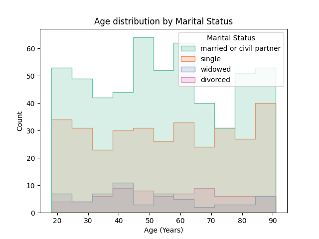
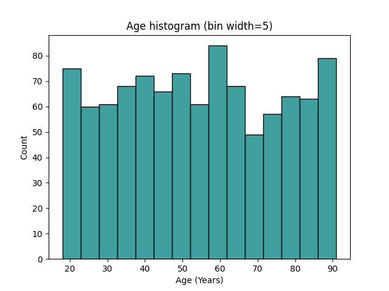
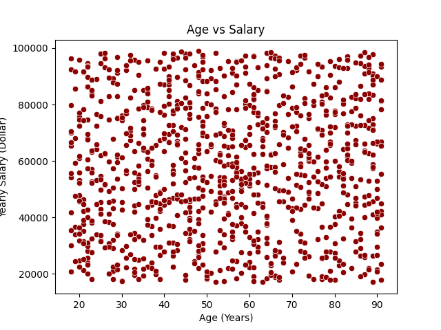
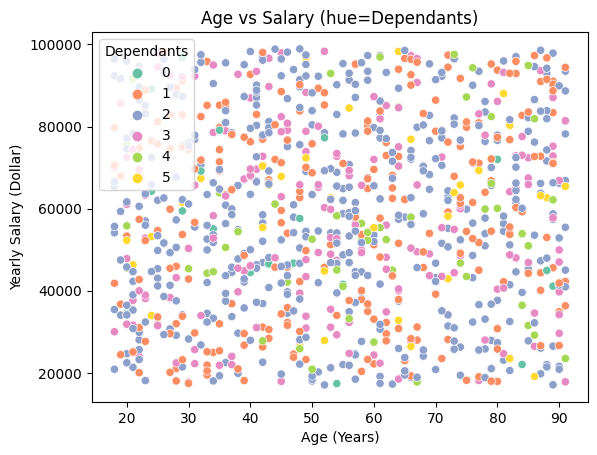
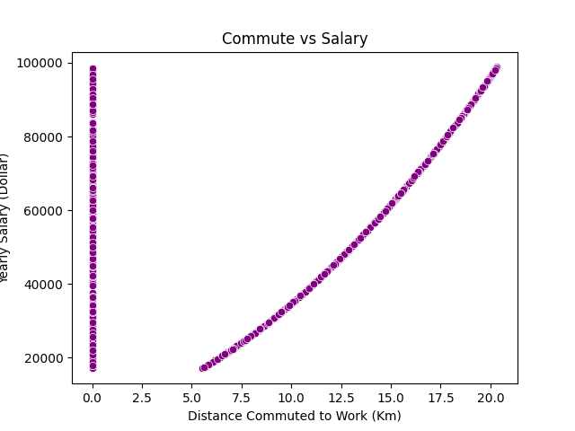
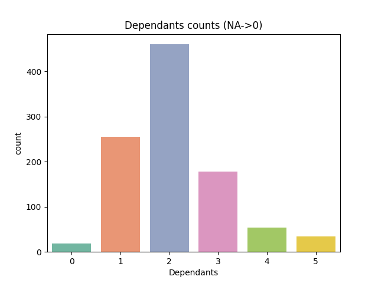

# Customer Data Preprocessing and Analysis using Python

This project was developed as part of the **Programming for AI and Data Science** module during my **MSc Artificial Intelligence at the University of Hull**.

The objective of this project is to clean, process, and analyse a customer dataset using Python. The project demonstrates how raw data can be transformed into structured and meaningful insights using data preprocessing, statistical analysis, and data visualization techniques.

---

# Dataset

The dataset used in this project:

acw_user_data.csv

The dataset contains information about customers including:

- Age
- Salary
- Number of dependants
- Employment status
- Commute distance
- Marital status
- Credit card details
- Address information
- Vehicle information

This dataset was used to perform data preprocessing and exploratory analysis.

---

# Project Tasks

The project performs several important data processing tasks.

## Data Loading

The dataset is loaded from a CSV file using Python.

## Data Cleaning

Data cleaning operations include:

- Removing extra spaces in text fields
- Converting values into correct data types
- Handling missing or incorrect values

## Data Categorization

Customers are separated into different categories such as:

- Retired users
- Employed users
- Users with expired credit cards

These datasets are exported into JSON files for structured storage.

## Feature Engineering

A new metric was created:

salary_commute = salary / commute_distance

This metric helps analyse how salary compares with commute distance.

## Statistical Analysis

Basic statistics were calculated using Pandas:

- Mean Salary
- Median Age

## Data Visualization

Multiple charts were generated using **Matplotlib and Seaborn** to understand patterns in the dataset.

---

# Technologies Used

This project was implemented using the following tools and libraries:

- Python
- Pandas
- Matplotlib
- Seaborn
- JSON
- CSV

---

# Key Results

Some important statistical results derived from the dataset include:

- Mean Salary: 57,814
- Median Age: 54

The dataset analysis also revealed patterns related to salary distribution, age groups, commuting distance, and dependants.

---

# Data Visualizations

Several visualizations were generated to explore relationships in the dataset.

## Age Distribution by Marital Status

This chart shows the distribution of ages grouped by marital status categories.

---

## Age Histogram

This histogram shows the distribution of customer ages across the dataset.

---

## Age vs Salary

This scatter plot visualizes the relationship between age and yearly salary.

---

## Age vs Salary by Dependants

This visualization shows salary patterns while considering the number of dependants.

---

## Commute Distance vs Salary

This chart explores the relationship between commuting distance and salary.

---

## Dependants Distribution

This chart displays the distribution of dependants among customers.

---

# Project Outputs

The project generates structured output files stored in:

acw_outputs/

Inside this folder:

JSON files contain processed datasets such as:

- employed users
- retired users
- processed dataset
- credit card filtered dataset

PNG files contain generated visualizations and charts.

---

# Author

Sohaib Nasir  
MSc Artificial Intelligence  
University of Hull
